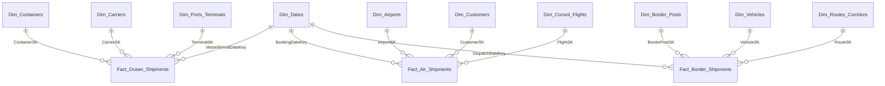

# Rhenus Air & Ocean (SA Division) Multi-Modal Supply Chain Performance Dashboard

An executive-grade, multi-modal supply chain analytics portfolio project designed to demonstrate advanced Power BI engineering, Star Schema dimensional modeling, T-SQL data warehousing pipelines, and complex DAX business logic. The project is tailored to the operations, regions, and logistics bottlenecks of a global third-party logistics (3PL) and freight forwarding provider operating out of South Africa.

---

## 📂 Project Repository Structure

```
├── README.md                           # Main project documentation and setup guide
├── SQL scripts/
│   └── init_db.sql                    # Production-grade DDL & mock data generation script
├── pbix/                               # Power BI Project (PBIP) files for source control
│   ├── logistics_co demo.Report/      # Visual layout, pages, and visual configurations
│   ├── logistics_co demo.SemanticModel/# Tables, relationships, and TMDL definitions
│   └── logistics_co demo.pbip         # Power BI Project entry point
├── theme/
│   ├── Rhenus.json                    # Custom Power BI theme JSON
│   └── Page1_Background.svg           # High-fidelity dashboard canvas background
└── project_docs/                       # Analytical blueprints, DAX references, and specs
    ├── Project Brief.md               # Context, constraints, and business goals
    ├── DAX Measures Reference.md      # Comprehensive list of the 36 deployed DAX measures
    ├── visualization_blueprint.md     # Layout, themes, and interactive dashboard wireframes
    └── viz walkthrough.md             # Walkthrough of visual configurations
```

---

## 🏗️ Data Warehouse Star Schema

The project implements a high-performance Star Schema optimized for DirectLake or Import modes in Microsoft Fabric and SQL Server. It separates operations into distinct shipping modalities, allowing for granular tracking of metrics specific to each transport type.

### Dimensional Layout



### 📊 Fact Table Grains
*   **`Fact_Ocean_Shipments`**: One row per container transaction (captures dwell times, demurrage/detention costs, and carrier performance).
*   **`Fact_Air_Shipments`**: One row per flight consolidation booking (captures actual vs. volumetric weight, buy/sell rates, and profit margins).
*   **`Fact_Border_Shipments`**: One row per cross-border road shipment (captures transit times, driving vs. border dwell hours, and schedule adherence).

---

## ⚡ Programmatically Injected Supply Chain Anomalies

To replicate real-world operational challenges in South Africa and test the analytical resilience of the model, the T-SQL generation script programmatically bakes in the following bottlenecks:
1.  **Durban Port Congestion**: Substantial berthing and offloading delays (8 to 22 days) at the **Port of Durban Container Terminals (Pier 1 & Pier 2)** during peak shipping windows, driving high demurrage costs.
2.  **Beitbridge Border Bottlenecks**: Multi-day transit spikes (12 to 72 hours dwell time) affecting the **Road Cross-Border** mode at the Beitbridge Border Post (Zimbabwe corridor), demonstrating severe schedule variances.
3.  **Utility & Power Fluctuations**: Simulated operational drops in warehouse throughput and processing efficiency representing the historical impacts of load-shedding.

---

## 📈 Key DAX Measures Deployed

The model contains **36 advanced DAX measures** organized into dedicated folders for easy discovery:

### 🚢 Ocean Freight (D&D Focus)
*   **`Total D&D Cost`**: Sum of demurrage and detention exposure.
*   **`Containers Exceeding Free Days %`**: Percentage of containers exceeding free-time allowance.
*   **`Port Congestion Rate %`**: Percentage of containers dwelling at a terminal for > 10 days (isolates Durban bottlenecks).
*   **`Avg Excess Dwell Days`**: Average days delayed beyond the free limit for impacted shipments.

### ✈️ Air Freight (Volumetric & Yield Focus)
*   **`Total Chargeable Weight`**: Implements the volumetric density factor ($1\text{ CBM} = 167\text{ kg}$) to choose the higher of actual vs. volumetric weight:
    $$\text{Chargeable Weight} = \max(\text{Actual Weight (KG)}, \text{Volume (CBM)} \times 167)$$
*   **`Air Gross Profit Margin %`**: Gross profit yield on airline buy rates vs. client sell rates.
*   **`Avg Sell Rate Per KG`** & **`Avg Buy Rate Per KG`**: Auditable pricing metrics by gateway.

### 🚛 Road Freight (OTD & Corridor Focus)
*   **`On-Time Delivery %`**: Shipments arriving within the schedule window (target transit hours + 30-min buffer).
*   **`Border Delay Rate %`**: Percentage of total transit hours consumed purely by border customs dwells.
*   **`Transit Time Variance (Hours)`**: Schedule variance against transit promises.

### 📊 Cross-Modal Summaries
*   **`Rolling 3-Month Demurrage`**: Multi-month smoothing calculation using time intelligence to trace long-term trends.
*   **`YoY Demurrage Delta`**: Year-over-Year penalty change comparison.

---

## 🎨 Premium Dashboard Design & Layouts

The Power BI report contains **4 distinct pages** that follow the **Rhenus Corporate Style Guide**:
*   **Theme Palette**: Rhenus Blue (`#002F6C`), Steel Blue (`#007ACC`), Success Teal (`#10B981`), and Warning Coral (`#EF4444`).
*   **Page 1: Multi-Modal Executive Overview** (Regional Logistics Director)
    *   *Highlights*: Combines cross-modal KPIs, monthly cost vs. revenue combo charts, shipment volume distribution, and top client profitability.
*   **Page 2: Ocean Freight Performance & Demurrage Analyzer** (Regional Marine Operations Manager)
    *   *Highlights*: Focuses on port congestion (highlighting Durban DCT), demurrage vs. free days scatter plots, and container dwell ledgers.
*   **Page 3: Air Freight Volumetric & Profit Margin Optimizer** (Air Freight Procurement Manager)
    *   *Highlights*: Volume audit scatter plot (actual weight vs. chargeable weight), buy/sell spreads by airport code (JNB, FRA, LHR), and customer profitability.
*   **Page 4: Cross-Border Road & Transit Time Monitor** (Cross-Border Fleet Manager)
    *   *Highlights*: Stacked corridor breakdowns (driving hours vs. border dwell), border post bottleneck analysis (Beitbridge delay metrics), and fleet/vehicle scorecards.

---

## 🚀 Deployment Instructions

### Step 1: Initialize Database & Data Warehouse
Run [SQL scripts/init_db.sql](file:///Users/laptop/Library/CloudStorage/GoogleDrive-gugrajah.m@gmail.com/My%20Drive/Jobs/RecruitmentPig%20Logistics/project/SQL%20scripts/init_db.sql) in SQL Server Management Studio (SSMS), Azure SQL Database, or Microsoft Fabric Warehouse. This script will:
*   Create all Star Schema tables and foreign keys.
*   Populate logistics dimension tables (Durban ports, OR Tambo, Beitbridge, MSC, Maersk, etc.).
*   Populate 1,200 transactional records complete with sequentially consistent timestamps and localized delays.

### Step 2: Open Power BI Project
1.  Navigate to the `pbix` directory.
2.  Open [logistics_co demo.pbip](file:///Users/laptop/Library/CloudStorage/GoogleDrive-gugrajah.m@gmail.com/My%20Drive/Jobs/RecruitmentPig%20Logistics/project/pbix/logistics_co%20demo.pbip) in **Power BI Desktop** (March 2024 version or later).
3.  Adjust the data source connection settings to point to your SQL Server / Fabric database.

### Step 3: Import Corporate Theme & Layout
1.  In Power BI Desktop, go to the **View** ribbon.
2.  Expand the **Themes** section and click **Browse for Themes**.
3.  Select [theme/Rhenus.json](file:///Users/laptop/Library/CloudStorage/GoogleDrive-gugrajah.m@gmail.com/My%20Drive/Jobs/RecruitmentPig%20Logistics/project/theme/Rhenus.json) to apply corporate colors, Segoe UI typography, and visual borders automatically.
4.  Optionally, import [theme/Page1_Background.svg](file:///Users/laptop/Library/CloudStorage/GoogleDrive-gugrajah.m@gmail.com/My%20Drive/Jobs/RecruitmentPig%20Logistics/project/theme/Page1_Background.svg) as the canvas background image (set Transparency to 0% and Image Fit to "Fit").

### Step 4: Configure Semantic Model Settings
*   Ensure the active relationship from `Fact_Ocean_Shipments[VesselArrivalDateKey]` to `Dim_Dates[DateKey]` is enabled.
*   Mark `Dim_Dates` as the **Date Table** (`CalendarDate` field) in Power BI Desktop model view so that the Time Intelligence measures compute correctly.
