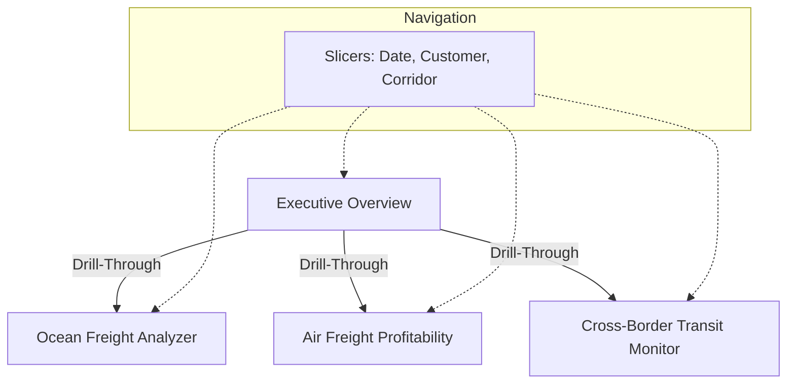

# Power BI Dashboard Visualisation Blueprint — Rhenus Air & Ocean (SA Division)
## Executive-Grade Multi-Modal Supply Chain Performance Dashboard

Now that the semantic model, relationships, and all 36 DAX measures are deployed in the **logistics_co demo** Power BI model, the next step is to design a high-fidelity visual experience. 

This document serves as a complete **Visualisation Blueprint** to translate the underlying database tables and DAX measures into a premium, executive-ready dashboard portfolio. It is designed to wow the hiring panel at Rhenus by focusing on high-impact visual design, clear UX layouts, and business-focused dashboards.

---

## 🎨 1. Rhenus Corporate Design System

A consistent, professional aesthetic is critical for executive dashboards. Avoid generic, bright default colors. Instead, use a curated color palette that reflects the **Rhenus Logistics** brand identity, using a clean slate background, dark primary elements, and functional status colors (Teal for success/on-time, Coral/Amber for bottlenecks/delays).

### Theme Color Palette

*   **Primary Navy** (`#002F6C`): Used for headers, navigation elements, card visual values, and primary charts.
*   **Secondary Steel Blue** (`#007ACC`): Used for comparison columns, secondary categories, and active states.
*   **Accent Teal / Success** (`#10B981`): Used for "On-Time", "Exceeds Target", and profitable margins.
*   **Accent Coral / Warning** (`#EF4444`): Used for "Late Delivery", "Demurrage Charges", and port congestion.
*   **Muted Slate / Background** (`#F8FAFC`): Used for the report background.
*   **Visual Container Background** (`#FFFFFF` with 8px border-radius and subtle drop shadow: `X=0, Y=2, Blur=8, Color=0,0,0,0.05`): Used for individual visuals to create a clean, modern "card" layout.

### Custom Power BI Theme JSON
You can import this JSON file into Power BI (under **View** → **Themes** dropdown → **Browse for Themes**) to instantly apply these colors, typography, and default card styles to your report:

```json
{
  "name": "Rhenus Logistics Premium Theme",
  "dataColors": [
    "#002F6C",
    "#007ACC",
    "#10B981",
    "#EF4444",
    "#F59E0B",
    "#6B7280",
    "#8B5CF6",
    "#EC4899"
  ],
  "background": "#F8FAFC",
  "foreground": "#002F6C",
  "tableAccent": "#007ACC",
  "textClasses": {
    "callout": {
      "fontSize": 24,
      "fontFamily": "Segoe UI Semibold",
      "color": "#002F6C"
    },
    "title": {
      "fontSize": 12,
      "fontFamily": "Segoe UI Semibold",
      "color": "#002F6C"
    },
    "header": {
      "fontSize": 11,
      "fontFamily": "Segoe UI Semibold",
      "color": "#002F6C"
    },
    "label": {
      "fontSize": 9,
      "fontFamily": "Segoe UI",
      "color": "#6B7280"
    }
  },
  "visualStyles": {
    "*": {
      "*": {
        "background": [
          {
            "show": true,
            "color": { "solid": { "color": "#FFFFFF" } },
            "transparency": 0
          }
        ],
        "border": [
          {
            "show": true,
            "color": { "solid": { "color": "#E2E8F0" } },
            "width": 1
          }
        ],
        "dropShadow": [
          {
            "show": true,
            "position": "Outer",
            "preset": "Custom",
            "shadowColor": { "solid": { "color": "#000000" } },
            "transparency": 95,
            "blur": 8,
            "angle": 135,
            "distance": 2
          }
        ]
      }
    },
    "card": {
      "*": {
        "labels": [
          {
            "show": true,
            "color": { "solid": { "color": "#6B7280" } },
            "fontSize": 9,
            "fontFamily": "Segoe UI"
          }
        ],
        "cardDataLabels": [
          {
            "color": { "solid": { "color": "#002F6C" } },
            "fontSize": 22,
            "fontFamily": "Segoe UI Semibold"
          }
        ]
      }
    }
  }
}
```

---

## 📑 2. Dashboard Page Blueprints

The dashboard should consist of **4 key pages** built in a single Power BI report to enable drill-through, cross-filtering, and dynamic exploration.



---

### Page 1: Multi-Modal Executive Overview
*   **Target Persona**: Regional Logistics Director (Executive)
*   **Business Goal**: High-level cross-modal overview of shipment volumes, cost exposure, and gross margins to monitor corporate health.

```
+-------------------------------------------------------------------------------------------------------+
|  [Logo] Rhenus SA Division — Executive Logistics Overview                   [Slicers: Year/Month, Vertical]  |
+-------------------------------------------------------------------------------------------------------+
|  +-------------------+  +-------------------+  +-------------------+  +---------------------------+   |
|  | Total Shipments   |  | Total Log Cost    |  | Total Log Revenue |  | Overall Gross Margin      |   |
|  |     1,200         |  |    R5.25M         |  |    R15.82M        |  |          58.4%            |   |
|  +-------------------+  +-------------------+  +-------------------+  +---------------------------+   |
+-------------------------------------------------------------------------------------------------------+
|  +-------------------------------------------------+  +--------------------------------------------+  |
|  | Visual 1: Monthly Cost vs Revenue Trends (Combo)|  | Visual 2: Shipment Volume by Mode (Donut)  |  |
|  |  * Column: Total Logistics Revenue              |  |  * Ocean: 400 (33.3%)                      |  |
|  |  * Line: Total Logistics Cost                   |  |  * Air: 400 (33.3%)                        |  |
|  |                                                 |  |  * Road: 400 (33.3%)                       |  |
|  +-------------------------------------------------+  +--------------------------------------------+  |
+-------------------------------------------------------------------------------------------------------+
|  +-------------------------------------------------+  +--------------------------------------------+  |
|  | Visual 3: Top Customers by Profit (Bar Chart)   |  | Visual 4: Multi-Modal Performance Summary  |  |
|  |  * Sasol Mining Solutions: R4.2M                |  |  * Grid showing: Mode, Shipments, Cost,    |  |
|  |  * BMW South Africa: R3.8M                      |  |    Revenue, Margin %, OTD %                |  |
|  |  * Vodacom Retail: R3.1M                        |  |                                            |  |
|  +-------------------------------------------------+  +--------------------------------------------+  |
+-------------------------------------------------------------------------------------------------------+
```

#### Visual Layout & Configurations
1.  **KPI Card Row (Top)**:
    *   **Visuals**: New KPI Visual or Card (New) in Power BI.
    *   **Measures**:
        *   `Total Shipments (All Modes)`
        *   `Total Logistics Cost` (ZAR)
        *   `Total Logistics Revenue` (ZAR)
        *   `Overall Gross Margin %` (Format as percentage `0.0%`).
2.  **Visual 1: Monthly Cost vs Revenue Trends (Left)**:
    *   **Visual Type**: Line and Clustered Column Chart.
    *   **X-Axis**: `Dim_Dates[CalendarMonth]` or `Dim_Dates[MonthName]` (sorted chronologically by `CalendarMonth`).
    *   **Column Y-Axis**: `Total Logistics Revenue`
    *   **Line Y-Axis**: `Total Logistics Cost`
    *   **UX Note**: Colors should be `#002F6C` (Revenue) and `#007ACC` (Cost) to show profitability over time.
3.  **Visual 2: Shipment Volume Share by Mode (Right)**:
    *   **Visual Type**: Donut Chart.
    *   **Legend**: `Dim_Carriers[ModeOfTransport]`
    *   **Values**: `Total Shipments (All Modes)`
    *   **UX Note**: Use data labels to show Category + Percent of Total.
4.  **Visual 3: Top Customers by Profit (Bottom Left)**:
    *   **Visual Type**: Horizontal Bar Chart.
    *   **Y-Axis**: `Dim_Customers[CustomerName]`
    *   **X-Axis**: `Air Gross Profit` (since Air is the primary revenue-generating fact in this model).
    *   **Tooltip**: `Air Gross Profit Margin %`, `Total Chargeable Weight`
5.  **Visual 4: Multi-Modal Performance Summary (Bottom Right)**:
    *   **Visual Type**: Table.
    *   **Columns**: `Dim_Carriers[ModeOfTransport]`, `Total Shipments (All Modes)`, `Total Logistics Cost`, `Total Logistics Revenue`, `Overall Gross Margin %`.
    *   **UX Note**: Apply conditional formatting on `Overall Gross Margin %` (green background for > 40%, white for baseline, red/pink for underperforming).

---

### Page 2: Ocean Freight Performance & Demurrage Analyzer
*   **Target Persona**: Regional Marine Operations Manager
*   **Business Goal**: Identify demurrage/detention (D&D) cost leakage, isolate terminal bottlenecks, and analyze Ocean carrier penalties.

```
+-------------------------------------------------------------------------------------------------------+
|  [Logo] Ocean Freight Congestion & D&D Analyzer                             [Slicers: Port, Carrier]  |
+-------------------------------------------------------------------------------------------------------+
|  +-------------------+  +-------------------+  +-------------------+  +---------------------------+   |
|  | Total D&D Cost    |  | Demurrage Cost    |  | Detention Cost    |  | Containers Exceeding Free |   |
|  |    R2.86M         |  |    R2.54M         |  |    R320k          |  |          74.2%            |   |
|  +-------------------+  +-------------------+  +-------------------+  +---------------------------+   |
+-------------------------------------------------------------------------------------------------------+
|  +-------------------------------------------------+  +--------------------------------------------+  |
|  | Visual 1: Port Congestion & Dwell Days (Combo)  |  | Visual 2: Demurrage vs Free Days Allowed   |  |
|  |  * X-Axis: TerminalName / PortName              |  |  * Scatter plot: Carrier Name              |  |
|  |  * Bars: Avg Dwell Days (Durban will spike!)    |  |  * X-Axis: Ocean Shipment Count            |  |
|  |  * Line: Port Congestion Rate %                 |  |  * Y-Axis: Demurrage Per Container         |  |
|  +-------------------------------------------------+  +--------------------------------------------+  |
+-------------------------------------------------------------------------------------------------------+
|  +-------------------------------------------------+  +--------------------------------------------+  |
|  | Visual 3: Demurrage Cost Trend (Area Chart)      |  | Visual 4: Vessel Dwell Days Table          |  |
|  |  * Primary Line: Total Demurrage Cost           |  |  * Container, Port, Carrier, Dwell Days,   |  |
|  |  * Secondary Line: Rolling 3-Month Demurrage    |  |    Free Days, Demurrage Cost, Detention    |  |
|  +-------------------------------------------------+  +--------------------------------------------+  |
+-------------------------------------------------------------------------------------------------------+
```

#### Visual Layout & Configurations
1.  **KPI Card Row**:
    *   `Total D&D Cost` (ZAR)
    *   `Total Demurrage Cost` (ZAR)
    *   `Total Detention Cost` (ZAR)
    *   `Containers Exceeding Free Days %` (Color red if > 50% to flag structural delay).
2.  **Visual 1: Port Congestion & Dwell Days**:
    *   **Visual Type**: Line and Stacked Column Chart.
    *   **X-Axis**: `Dim_Ports_Terminals[TerminalName]` (Drill-up to `PortName`).
    *   **Column Y-Axis**: `Avg Dwell Days`
    *   **Line Y-Axis**: `Port Congestion Rate %`
    *   **Strategic Callout**: This visual will highlight **Port of Durban DCT Pier 1 & Pier 2** as massive congestion bottlenecks where dwell days exceed the standard 7 free days.
3.  **Visual 2: Carrier Performance Matrix**:
    *   **Visual Type**: Scatter Chart.
    *   **X-Axis**: `Ocean Shipment Count` (volume)
    *   **Y-Axis**: `Demurrage Per Container` (cost efficiency)
    *   **Size**: `Total Demurrage Cost`
    *   **Play Axis**: `Dim_Dates[CalendarMonth]` (optional, to animate over time).
    *   **UX Note**: The top-right quadrant flags high-volume, high-penalty carriers (e.g., MSC or Maersk under Durban congestion).
4.  **Visual 3: Demurrage Cost Trend**:
    *   **Visual Type**: Area Chart (or Line Chart with shading).
    *   **X-Axis**: `Dim_Dates[CalendarDate]` (grouped by Month/Year).
    *   **Y-Axis**: `Total Demurrage Cost` and `Rolling 3-Month Demurrage`.
    *   **Strategic Callout**: Shows the smoothing effect of the 3-month rolling measure against monthly spikes, showing long-term trends.
5.  **Visual 4: Detailed Shipment / Container Ledger**:
    *   **Visual Type**: Table.
    *   **Columns**: `Dim_Containers[ContainerNumber]`, `Dim_Containers[ContainerType]`, `Dim_Ports_Terminals[PortName]`, `Dim_Carriers[CarrierName]`, `Fact_Ocean_Shipments[ActualDwellDays]`, `Fact_Ocean_Shipments[FreeDaysAllowed]`, `Total Demurrage Cost`, `Total Detention Cost`.

---

### Page 3: Air Freight Volumetric & Profit Margin Optimizer
*   **Target Persona**: Air Freight Procurement Manager
*   **Business Goal**: Audit chargeability ratio (chargeable vs actual weight), evaluate airline buy/sell margins, and identify margin leakage.

```
+-------------------------------------------------------------------------------------------------------+
|  [Logo] Air Freight Volumetric & Margin Optimizer                           [Slicers: Customer, Airport]  |
+-------------------------------------------------------------------------------------------------------+
|  +-------------------+  +-------------------+  +-------------------+  +---------------------------+   |
|  | Air Shipments     |  | Chargeable Weight |  | Air Gross Profit  |  | Air Gross Profit Margin % |   |
|  |      400          |  |   742,500 kg      |  |    R1.45M         |  |          22.6%            |   |
|  +-------------------+  +-------------------+  +-------------------+  +---------------------------+   |
+-------------------------------------------------------------------------------------------------------+
|  +-------------------------------------------------+  +--------------------------------------------+  |
|  | Visual 1: Buy vs Sell Rates by Airport (Column) |  | Visual 2: Actual vs Volumetric Weight      |  |
|  |  * X-Axis: Airport IATA Code (JNB, FRA, LHR)    |  |  * Scatter: Individual Air Shipment ID     |  |
|  |  * Column 1: Avg Buy Rate Per KG                |  |  * X-Axis: Total Actual Weight (KG)        |  |
|  |  * Column 2: Avg Sell Rate Per KG               |  |  * Y-Axis: Total Chargeable Weight         |  |
|  +-------------------------------------------------+  +--------------------------------------------+  |
+-------------------------------------------------------------------------------------------------------+
|  +-------------------------------------------------+  +--------------------------------------------+  |
|  | Visual 3: Profit Margin by Customer (Bar Chart) |  | Visual 4: Flight Consolidation Summary     |  |
|  |  * Y-Axis: Dim_Customers[CustomerName]          |  |  * Table: Flight No, Airline Prefix,       |  |
|  |  * X-Axis: Air Gross Profit                     |  |    Total CBM, Chargeable Weight, Profit,   |  |
|  |  * Color Saturation: Air Gross Profit Margin %  |  |    GP Margin %                             |  |
|  +-------------------------------------------------+  +--------------------------------------------+  |
+-------------------------------------------------------------------------------------------------------+
```

#### Visual Layout & Configurations
1.  **KPI Card Row**:
    *   `Air Shipment Count`
    *   `Total Chargeable Weight` (KG)
    *   `Air Gross Profit` (ZAR)
    *   `Air Gross Profit Margin %` (Highlighting buy/sell markup health).
2.  **Visual 1: Buy vs Sell Rates by Trade-Lane (Airport)**:
    *   **Visual Type**: Clustered Column Chart.
    *   **X-Axis**: `Dim_Airports[IATACode]` (Drill-up to `Country`).
    *   **Y-Axis**: `Avg Buy Rate Per KG` and `Avg Sell Rate Per KG`.
    *   **UX Note**: Enables the freight procurement team to audit pricing spreads at OR Tambo (JNB) versus European ports (FRA, LHR).
3.  **Visual 2: Chargeable Weight Audit**:
    *   **Visual Type**: Scatter Chart.
    *   **X-Axis**: `Total Actual Weight (KG)`
    *   **Y-Axis**: `Total Chargeable Weight`
    *   **Details**: `Fact_Air_Shipments[AirShipmentID]`
    *   **Strategic Callout**: This scatter plot acts as a visual audit tool. Points that sit above the 1:1 diagonal represent low-density shipments billed on volumetric weight (`VolumeCBM * 167`). Points on the diagonal represent shipments billed on actual weight. High volumetric shipments flag opportunities for consolidation.
4.  **Visual 3: Customer Margin Performance**:
    *   **Visual Type**: Horizontal Bar Chart.
    *   **Y-Axis**: `Dim_Customers[CustomerName]` (Drill-down to `IndustryVertical`).
    *   **X-Axis**: `Air Gross Profit`
    *   **UX Note**: Apply conditional formatting on bar colors based on `Air Gross Profit Margin %` (lighter steel blue for lower margin, deep navy for high margin) to spot clients with poor margins.
5.  **Visual 4: Airline Flight Consolidation Ledger**:
    *   **Visual Type**: Table.
    *   **Columns**: `Dim_Consol_Flights[FlightNumber]`, `Dim_Consol_Flights[AirlinePrefix]`, `Total Volume (CBM)`, `Total Chargeable Weight`, `Air Gross Profit`, `Air Gross Profit Margin %`.

---

### Page 4: Cross-Border Road & Transit Time Monitor
*   **Target Persona**: Cross-Border Fleet & Corridor Manager
*   **Business Goal**: Track On-Time Delivery (OTD), isolate border post customs delays, and evaluate corridor performance.

```
+-------------------------------------------------------------------------------------------------------+
|  [Logo] Cross-Border Road & Transit Time Monitor                            [Slicers: Border, Fleet]  |
+-------------------------------------------------------------------------------------------------------+
|  +-------------------+  +-------------------+  +-------------------+  +---------------------------+   |
|  | Road Shipments    |  | On-Time Delivery %|  | OTD vs Target Gap |  | Avg Border Dwell Hours    |   |
|  |      400          |  |      82.4%        |  |     -12.6%        |  |          24.5 hrs         |   |
|  +-------------------+  +-------------------+  +-------------------+  +---------------------------+   |
+-------------------------------------------------------------------------------------------------------+
|  +-------------------------------------------------+  +--------------------------------------------+  |
|  | Visual 1: Corridor Transit Breakdown (Stacked)  |  | Visual 2: Border Post Delay Bottlenecks   |  |
|  |  * X-Axis: Origin-Destination Corridor          |  |  * Bars: Avg Border Dwell Hours            |  |
|  |  * Segment 1: Avg Line Haul Driving Hours       |  |  * Line: Border Delay Rate %               |  |
|  |  * Segment 2: Avg Border Dwell Hours            |  |  (Beitbridge will dominate this chart)     |  |
|  +-------------------------------------------------+  +--------------------------------------------+  |
+-------------------------------------------------------------------------------------------------------+
|  +-------------------------------------------------+  +--------------------------------------------+  |
|  | Visual 3: Transit Time Variance Trend (Line)    |  | Visual 4: Haulier & Fleet Scorecard        |  |
|  |  * Line 1: Transit Time Variance (Hours)        |  |  * Fleet ID, Vehicle Type, Shipments,      |  |
|  |  * Line 2: Transit Time Variance %              |  |    OTD %, Border Delay Rate %, Late Count  |  |
|  +-------------------------------------------------+  +--------------------------------------------+  |
+-------------------------------------------------------------------------------------------------------+
```

#### Visual Layout & Configurations
1.  **KPI Card Row**:
    *   `Border Shipment Count`
    *   `On-Time Delivery %` (Apply target line of 95%).
    *   `OTD vs Target Gap` (Format with dynamic coloring: green text if positive, red if negative).
    *   `Avg Border Dwell Hours` (Key operational bottleneck metric).
2.  **Visual 1: Corridor Transit Time Breakdown**:
    *   **Visual Type**: Stacked Bar Chart.
    *   **Y-Axis**: `Dim_Routes_Corridors[OriginLocation]` + `Dim_Routes_Corridors[DestinationLocation]`
    *   **X-Axis (Values)**: `Avg Line Haul Hours` (Pure driving) and `Avg Border Dwell Hours` (Customs wait).
    *   **UX Note**: This visual decomposes the transit time, showing that the Harare Corridor delay is primarily a border bottleneck, whereas the domestic Pretoria Cross-Dock is mostly driving time.
3.  **Visual 2: Border Post Bottleneck Analysis**:
    *   **Visual Type**: Line and Clustered Column Chart.
    *   **X-Axis**: `Dim_Border_Posts[BorderPostName]`
    *   **Column Y-Axis**: `Avg Border Dwell Hours`
    *   **Line Y-Axis**: `Border Delay Rate %`
    *   **Strategic Callout**: This visual highlights the **Beitbridge Border Post** as the primary bottleneck, where dwell times spike to 12-72 hours compared to domestic or other regional posts.
4.  **Visual 3: Transit Time Variance Trends**:
    *   **Visual Type**: Line Chart.
    *   **X-Axis**: `Dim_Dates[CalendarDate]` (grouped by Month).
    *   **Y-Axis**: `Transit Time Variance (Hours)` and `Transit Time Variance %`.
    *   **UX Note**: Add a constant line at `Y = 0` (perfect schedule adherence). Anything above the line indicates delays; anything below indicates early arrivals.
5.  **Visual 4: Vehicle & Fleet Performance Scorecard**:
    *   **Visual Type**: Matrix / Table.
    *   **Columns**: `Dim_Vehicles[FleetID]`, `Dim_Vehicles[VehicleType]`, `Border Shipment Count`, `On-Time Delivery %`, `Late Delivery Count`, `Avg Total Transit Hours`.

---

## ⚙️ 3. Navigation & UX Best Practices

To make this dashboard feel like a high-end application, configure the following interactions:

### 1. Cross-Filtering and Slicers
*   Place the **Slicer Pane** consistently on the right-hand side of all four pages or use a pop-out slicer pane.
*   **Global Slicers**:
    *   `Dim_Dates[CalendarYear]` & `Dim_Dates[MonthName]` (Multi-select dropdown).
    *   `Dim_Customers[IndustryVertical]` (Horizontal button segment).
*   **Local Slicers**:
    *   **Ocean Page**: `Dim_Ports_Terminals[PortName]` & `Dim_Carriers[CarrierName]`
    *   **Air Page**: `Dim_Airports[IATACode]`
    *   **Border Page**: `Dim_Border_Posts[BorderPostName]`

### 2. Drill-Through Actions
*   Configure a drill-through action from the **Multi-Modal Executive Overview** page:
    *   Right-clicking a transport mode in Visual 2 (Donut Chart) or Visual 4 (Table) should allow the user to **Drill-Through** directly to the respective Mode-Specific Performance page (Ocean, Air, or Road), passing the filter context for that mode.

### 3. Custom Report Page Tooltips
Instead of default tooltips, create a dedicated tooltips page (`Tooltip - Port Details`):
*   When hovering over a specific terminal in Page 2 (Ocean) Visual 1, show a small visual tooltip containing:
    *   The terminal's count of shipments.
    *   Total D&D cost.
    *   A mini card with the `Containers Exceeding Free Days %` to immediately explain *why* that terminal is bottlenecked.

---

## 🚀 4. Step-by-Step Implementation Guide

To implement this blueprint in your current Power BI project, follow these actions:

1.  **Import the Custom Theme**:
    *   Save the JSON block from Section 1 to a file named `RhenusTheme.json`.
    *   In Power BI Desktop, navigate to the **View** ribbon → click the dropdown under **Themes** → select **Browse for themes** and select the saved JSON.
2.  **Create Navigation Tab Bar**:
    *   Use the **Navigator** visual (**Insert** → **Buttons** → **Navigator** → **Page Navigator**) to automatically create a clean, styled tab bar at the top of every page. Apply a light gray background to inactive tabs and Rhenus Navy to the active page.
3.  **Build the Canvas Layout**:
    *   Set Page background to `#F8FAFC` (under Format page → Canvas background → color `#F8FAFC`, Transparency = 0%).
    *   Turn on **Visual borders** (color `#E2E8F0`, Round corners = 8px) and **Drop shadows** (Position: Outer, Transparency = 95%, Blur = 8px) for all visual containers.
4.  **Assign Formats to Measures**:
    *   Select each measure in the model and verify their format:
        *   Costs and Revenue measures: Format as **Currency**, Symbol: `R` (ZAR), decimal places: `0` or `2`.
        *   Percentages (OTD, Margins, Variance %): Format as **Percentage**, decimal places: `1`.
        *   Weights and Volumes: Format as **Decimal**, with suffix ` kg` or ` m³` where appropriate.
5.  **Verify Bottleneck Visibility**:
    *   Confirm that the Durban port congestion and Beitbridge border delays (which were programmatically injected into the SQL mock data) are visibly highlighted in Page 2 (Ocean) and Page 4 (Road) visuals.
